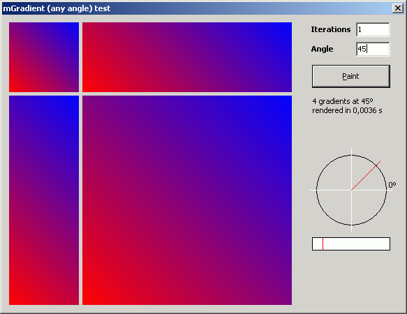



## Any angle gradient \(bonus: circular gradient\)

### Description

More gradients (last one, I hope): Now, 'any angle' gradient. // For fastest renderings, see my other post (Code ID: 60477; only for horizontal, vertical and both diagonals directions). // Last update Dec 13th, 2005: Improvements in circular gradient. SQR function completely avoided: using axis squares sum accumulators + squares sequence.
 
### More Info
 

             |
---                |---
**Submitted On**   |2005-05-23 00:38:24
**By**             |[Carles P\.V\.](https://github.com/Planet-Source-Code/PSCIndex/blob/master/ByAuthor/carles-p-v.md)
**Level**          |Intermediate
**User Rating**    |5.0 (85 globes from 17 users)
**Compatibility**  |VB 4\.0 \(32\-bit\), VB 5\.0, VB 6\.0
**Category**       |[Graphics](https://github.com/Planet-Source-Code/PSCIndex/blob/master/ByCategory/graphics__1-46.md)
**World**          |[Visual Basic](https://github.com/Planet-Source-Code/PSCIndex/blob/master/ByWorld/visual-basic.md)
**Archive File**   |[Any\_angle\_19597612252005\.zip](https://github.com/Planet-Source-Code/carles-p-v-any-angle-gradient-bonus-circular-gradient__1-60580/archive/master.zip)

